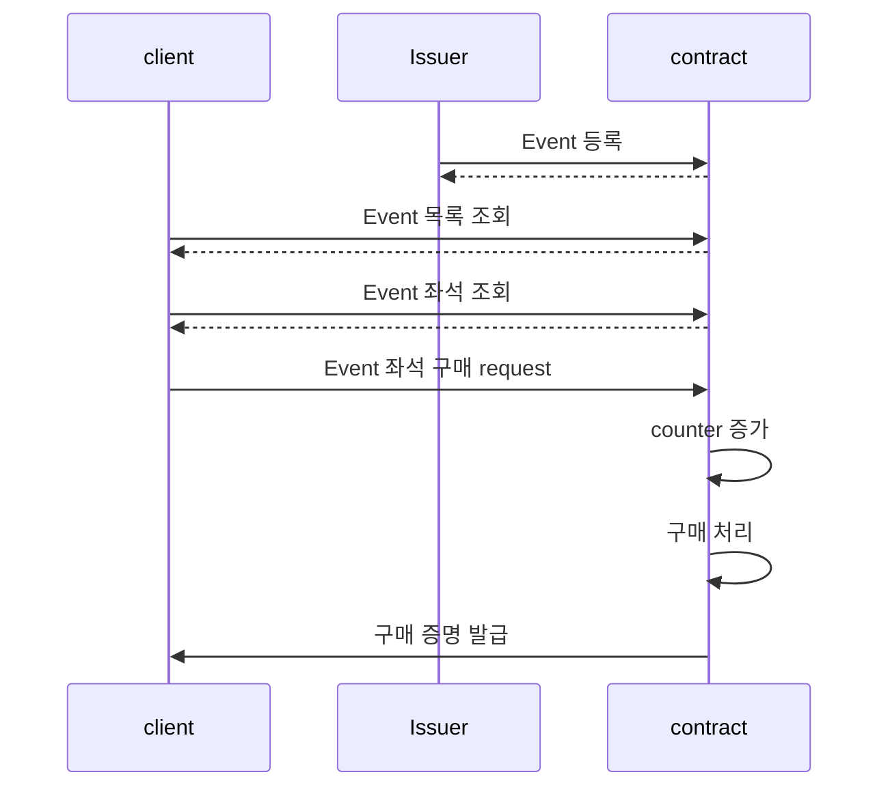

# T-MON (Ticket Monad)

<h3>Monad의 높은 TPS를 이용한 선착순 티켓팅 시스템</h3>

## Pain point

- 티켓팅때마다 줄 일찍 서고 브라우저 켜 놓고 있어야 하는 불편함
- 줄 일찍 섰다가 브라우저 오류로 튕기는 등, 브라우저 튕길 엑션을 하면, 노력이 말짱 헛수고가 됨

## Solution

Monad 기반 fair queuing 티켓팅 시스템

## Diagram

## Monad에서 가능한가?

### 의문1: Monad의 async성과의 충돌?

- 만약 모든 tx가 async하게 처리된다면, 선착순과 상관없이 노드에서 처리되는 순서가 랜덤해질 가능성
- 실행은 optimistic async하지만, tx 들어온 순서는 보장되며 commit은 순차적으로 진행
- Tx 접수 mempool 순서 보장

### 의문2: MEV protection

- Validator가 수수료 수익 최적화를 위해 Tx 처리 순서를 reorg
- Contract 내 index 처리

## 개선점

- Monad + EVM contract 기반 fair queuing
  - Minting같은 on-chain에는 instant minting이기에 queuing이 필요없음
  - Web2 ticketing과 연동한다면 지갑 기반 티켓팅 트래픽 통제 솔루션으로 발전 가능
- MEV protection 개선방법
  - Hash만 제출 후 추후 선착순 여부 확인 (commit - reveal)
  - Hash 단계에서 deposit 제출 (reveal시 환불)
